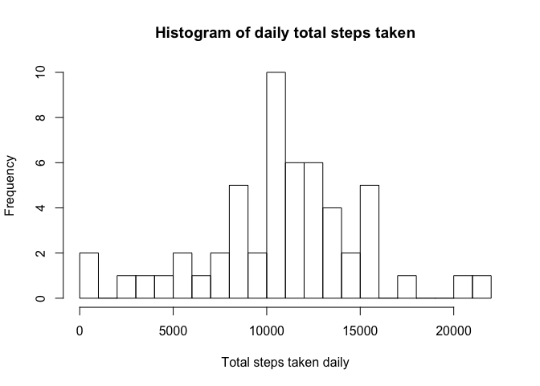
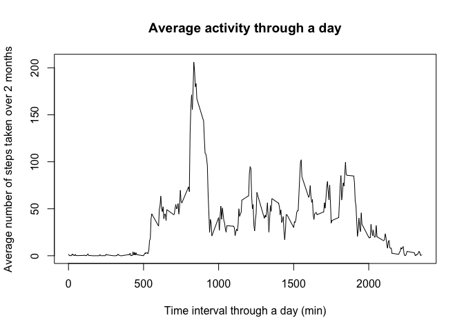
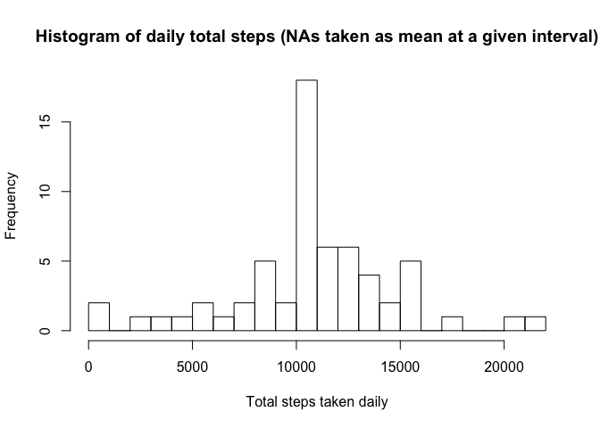
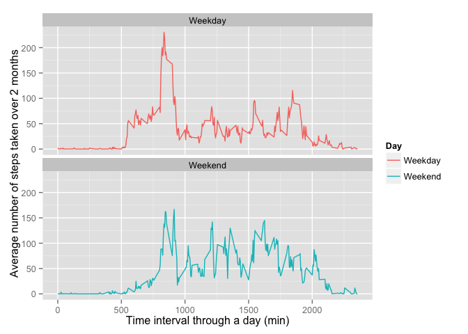

# Reproducible Research: Peer Assessment 1


## Loading and preprocessing the data

1. Load the data: Set directory, unzip and load data.

```r
setwd("/Users/yingjiang/Dropbox/Education/Coursera/data_science_spec/data_science_c5/Projects/Project1/RepData_PeerAssessment1")
unzip("activity.zip")
```

2. Process / transform the data (if necessary) into a format suitable for your analysis.

```r
# Read data
activity <- read.csv("activity.csv")
# Remove cases (observations) with missing values
activity_compl <- activity[complete.cases(activity), ]
activity_compl$date <- as.factor(as.character(activity_compl$date))
head(activity_compl)
```

```
##     steps       date interval
## 289     0 2012-10-02        0
## 290     0 2012-10-02        5
## 291     0 2012-10-02       10
## 292     0 2012-10-02       15
## 293     0 2012-10-02       20
## 294     0 2012-10-02       25
```


## What is mean total number of steps taken per day?

1. Calculate the total number of steps taken per day

```r
# Calculate total number of steps taken each day, and store as a vector element.
dailysums <- as.numeric(by(activity_compl$steps, activity_compl$date, sum))
head(dailysums)
```

```
## [1]   126 11352 12116 13294 15420 11015
```

2. Make a histogram of the total number of steps taken each day

```r
# Create vector of dates (for the 2 months of the study) and stitch to the daily total steps data. Transform into plotting-ready data.
dailytotalsteps <- as.data.frame(cbind(levels(activity_compl$date), dailysums), stringsAsFactors = F)
colnames(dailytotalsteps) <- c("Date", "Total.steps.taken")
dailytotalsteps$Date <- as.Date(dailytotalsteps$Date)
dailytotalsteps$Total.steps.taken <- as.numeric(dailytotalsteps$Total.steps.taken)
# Plot histogram
hist(dailytotalsteps$Total.steps.taken,
     breaks = 25,
     main = "Histogram of daily total steps taken",
     xlab = "Total steps taken daily",
     ylab = "Frequency")
```

 

3. Calculate and report the mean and median of the total number of steps taken per day

```r
# Calculate mean and median of daily total steps
mean(dailysums)
```

```
## [1] 10766.19
```

```r
median(dailysums)
```

```
## [1] 10765
```
The mean number of total steps taken per day is 1.0766189\times 10^{4}.

The median number of total steps taken per day is 1.0765\times 10^{4}.


## What is the average daily activity pattern?

1. Make a time series plot (i.e. type = "l") of the 5-minute interval (x-axis) and the average number of steps taken, averaged across all days (y-axis)

```r
# Calculate mean activity values at each time interval.
intervalmeans <- as.numeric(by(activity$steps, as.factor(activity$interval), mean, na.rm = TRUE))
# Stich mean activity values to the interval vector.
dailyactivitymeans <- as.data.frame(cbind(as.numeric(levels(as.factor(activity$interval))), intervalmeans), stringsAsFactors = F)
colnames(dailyactivitymeans) <- c("Time.interval", "Mean.steps.taken")
# Make plot
plot(x = dailyactivitymeans$Time.interval,
     y = dailyactivitymeans$Mean.steps.taken,
     main = "Average activity through a day",
     xlab = "Time interval through a day (min)",
     ylab = "Average number of steps taken over 2 months",
     type = "l")
```

 

2. Which 5-minute interval, on average across all the days in the dataset, contains the maximum number of steps?

```r
maxinterval <- dailyactivitymeans$Time.interval[which(dailyactivitymeans$Mean.steps.taken == max(dailyactivitymeans$Mean.steps.taken))]
maxstep <- max(dailyactivitymeans$Mean.steps.taken)
maxinterval
```

```
## [1] 835
```

```r
maxstep
```

```
## [1] 206.1698
```
The 835 interval recorded the highest average number of steps (206.1698113 steps).


## Imputing missing values

1. Calculate and report the total number of missing values in the dataset (i.e. the total number of rows with NAs)

```r
# Calculate total number of missing values
sum(is.na(activity$steps))
```

```
## [1] 2304
```
There are 2304 observations with missing values.

2. Devise a strategy for filling in all of the missing values in the dataset. The strategy does not need to be sophisticated. For example, you could use the mean/median for that day, or the mean for that 5-minute interval, etc.

```r
# Strategy to fill missing values: for each missing value at a particular time interval, fill in the 2-month average value for that interval.

# Replicate old dataset
activity_NAimputed <- activity

# Fill in missing values
for(i in 1:nrow(activity)) {
    if(is.na(activity_NAimputed$steps[i])) {
        activity_NAimputed$steps[i] <- intervalmeans[dailyactivitymeans$Time.interval == activity_NAimputed$interval[i]]
    }
}

# Check that there are no missing values in this imputed dataset.
sum(is.na(activity_NAimputed$steps)) # 0
```

```
## [1] 0
```

3. Create a new dataset that is equal to the original dataset but with the missing data filled in.

```r
# Create new dataset (activity_NAimputed) with missing values filled in.
dailysums_NAimputed <- as.numeric(by(activity_NAimputed$steps, activity_NAimputed$date, sum))
dailytotalsteps_NAimputed <- as.data.frame(cbind(levels(activity_NAimputed$date), dailysums_NAimputed), stringsAsFactors = F)
colnames(dailytotalsteps_NAimputed) <- c("Date", "Total.steps.taken")
dailytotalsteps_NAimputed$Date <- as.Date(dailytotalsteps_NAimputed$Date)
dailytotalsteps_NAimputed$Total.steps.taken <- as.numeric(dailytotalsteps_NAimputed$Total.steps.taken)
head(dailytotalsteps_NAimputed)
```

```
##         Date Total.steps.taken
## 1 2012-10-01          10766.19
## 2 2012-10-02            126.00
## 3 2012-10-03          11352.00
## 4 2012-10-04          12116.00
## 5 2012-10-05          13294.00
## 6 2012-10-06          15420.00
```

4. Make a histogram of the total number of steps taken each day and Calculate and report the mean and median total number of steps taken per day. Do these values differ from the estimates from the first part of the assignment? What is the impact of imputing missing data on the estimates of the total daily number of steps?

```r
# Make new histogram for daily sums; calculate new daily means and medians.
hist(dailytotalsteps_NAimputed$Total.steps.taken,
     breaks = 25,
     main = "Histogram of daily total steps (NAs taken as mean at a given interval)",
     xlab = "Total steps taken daily",
     ylab = "Frequency")
```

 

```r
# Calculate mean and median of daily total steps
mean(dailysums_NAimputed)
```

```
## [1] 10766.19
```

```r
median(dailysums_NAimputed)
```

```
## [1] 10766.19
```
After imputing the missing values, the mean number of total steps taken per day is 1.0766189\times 10^{4}.

The median number of total steps taken per day is 1.0766189\times 10^{4}.

Approximation of NAs by average interval values slightly increased the median, which is now pretty much equal to the mean. The number of days with total steps that are at the center of the distribution increased.


## Are there differences in activity patterns between weekdays and weekends?

1. Create a new factor variable in the dataset with two levels – “weekday” and “weekend” indicating whether a given date is a weekday or weekend day.

```r
# Created a new factor variable in the dataset, "day", with 2 levels "weekday" and "weekend".
activity_wk <- cbind(activity_NAimputed, factor(length(nrow(activity_NAimputed)), levels = c("weekday", "weekend")))
colnames(activity_wk)[4] <- "day"
activity_wk$date <- as.Date(activity_wk$date)
ifweekday <- weekdays(activity_wk$date)
for(i in 1:length(ifweekday)) {
    if(ifweekday[i] == "Saturday" | ifweekday[i] == "Sunday") {
        activity_wk$day[i] <- "weekend"
    } else {
        activity_wk$day[i] <- "weekday"
    }
}
head(activity_wk)
```

```
##       steps       date interval     day
## 1 1.7169811 2012-10-01        0 weekday
## 2 0.3396226 2012-10-01        5 weekday
## 3 0.1320755 2012-10-01       10 weekday
## 4 0.1509434 2012-10-01       15 weekday
## 5 0.0754717 2012-10-01       20 weekday
## 6 2.0943396 2012-10-01       25 weekday
```

2. Make a panel plot containing a time series plot (i.e. type = "l") of the 5-minute interval (x-axis) and the average number of steps taken, averaged across all weekday days or weekend days (y-axis). See the README file in the GitHub repository to see an example of what this plot should look like using simulated data.

```r
# Average activity across all weekdays or all weekends.
activity_split <- split(activity_wk, activity_wk$day)
intervalmeans_wkday <- as.numeric(by(activity_split[[1]]$steps, as.factor(activity_split[[1]]$interval), mean, na.rm = TRUE))
intervalmeans_wkend <- as.numeric(by(activity_split[[2]]$steps, as.factor(activity_split[[2]]$interval), mean, na.rm = TRUE))

dailyactivitymeans_wkday <- as.data.frame(cbind(as.numeric(levels(as.factor(activity$interval))), intervalmeans_wkday, rep("Weekday", length(intervalmeans_wkday))), stringsAsFactors = F)
dailyactivitymeans_wkend <- as.data.frame(cbind(as.numeric(levels(as.factor(activity$interval))), intervalmeans_wkend, rep("Weekend", length(intervalmeans_wkend))), stringsAsFactors = F)
colnames(dailyactivitymeans_wkday) <- c("Time.interval", "Mean.steps.taken", "Day")
colnames(dailyactivitymeans_wkend) <- c("Time.interval", "Mean.steps.taken", "Day")
dailyactivitymeans_wk <- as.data.frame(rbind(dailyactivitymeans_wkday, dailyactivitymeans_wkend))

dailyactivitymeans_wk$Time.interval <- as.numeric(dailyactivitymeans_wk$Time.interval)
dailyactivitymeans_wk$Mean.steps.taken <- as.numeric(dailyactivitymeans_wk$Mean.steps.taken)
dailyactivitymeans_wk$Day <- as.factor(dailyactivitymeans_wk$Day)

head(dailyactivitymeans_wk)
```

```
##   Time.interval Mean.steps.taken     Day
## 1             0       2.25115304 Weekday
## 2             5       0.44528302 Weekday
## 3            10       0.17316562 Weekday
## 4            15       0.19790356 Weekday
## 5            20       0.09895178 Weekday
## 6            25       1.59035639 Weekday
```

```r
# Make a 2-panel plot of the average values
library(ggplot2)
g <- ggplot(dailyactivitymeans_wk, aes(x = Time.interval,
                                       y = Mean.steps.taken,
                                       colour = Day)) +
     geom_line(aes(colour = Day, group = Day)) + 
     facet_wrap(~Day, nrow = 2, ncol = 1) +
     labs(x = "Time interval through a day (min)",
          y = "Average number of steps taken over 2 months")
print(g)
```

 
